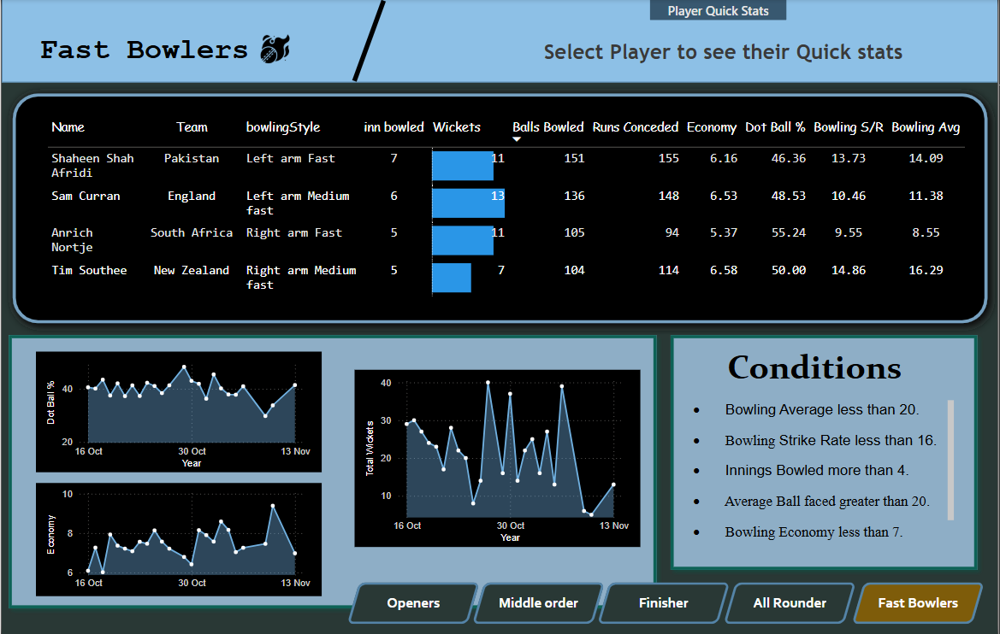
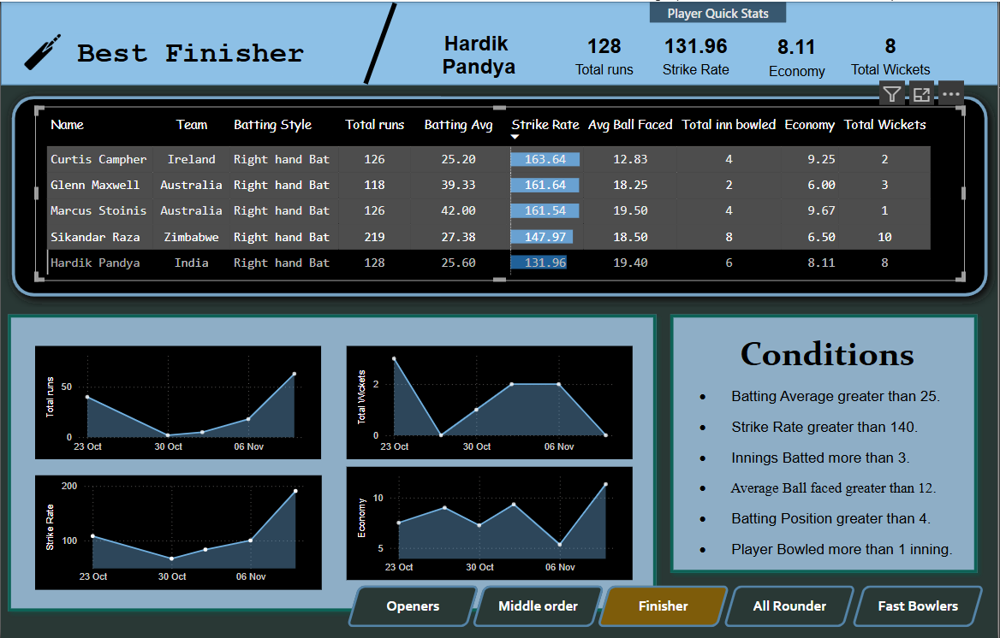
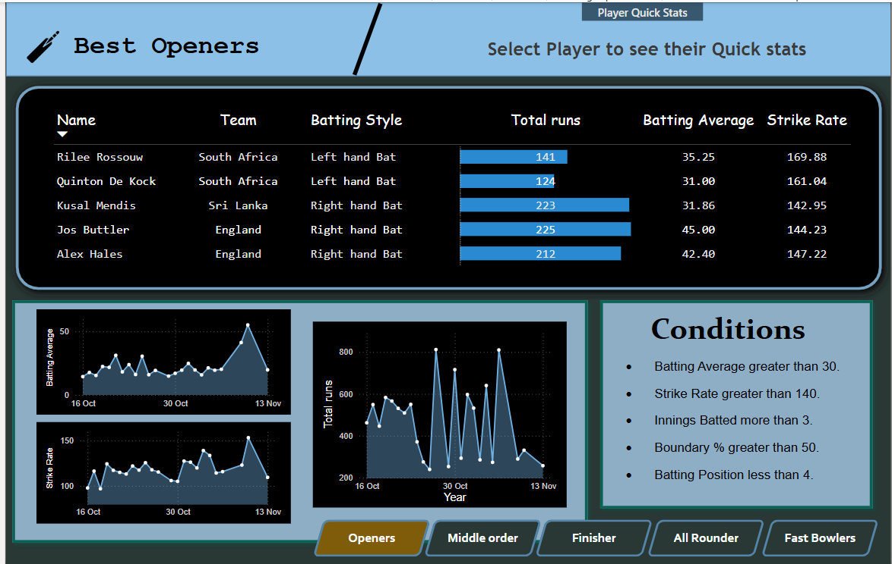

# 🏏 Cricket Player Analysis Dashboard - Power BI

This project showcases an interactive **Cricket Player Analysis Dashboard** created using **Power BI**. It leverages data transformation and web scraping to provide in-depth insights into cricket player performance across various metrics. Ideal for sports analysts or anyone interested in exploring the world of cricket analytics!

DashBoard Screenshots

1.

2.

## 📊 Key Features
- **Player Performance Analysis**: Interactive visualizations that track individual player statistics.
- **Batting and Bowling Insights**: Match-wise analysis for both batting and bowling performances.
- **Web Scraping**: Data is gathered from multiple sources, including live stats and player databases, using Python’s web scraping libraries.
- **DAX Calculations**: Measures like batting average, bowling economy, and strike rates are computed using Power BI's DAX functions.
- **Dynamic Slicers & Filters**: Users can filter data by player, year, country, and more for detailed insights.
- **Trend Analysis**: Line and bar charts to identify performance trends over time.

## 🛠️ Technologies Used
- **Power BI**: For building the interactive dashboard.
- **Python**:
  - **Pandas**: For data cleaning and transformation.
  - **BeautifulSoup & Requests**: For web scraping data from cricket statistics websites.
  - **NumPy**: For numerical operations and calculations.
- **DAX**: For creating calculated columns and measures within Power BI.

## 📁 Project Files
- [t20.pbix](asset/t20.pbix): The main Power BI file with all visuals, measures, and relationships.
- [Csv Files](worldcup-files): Folder containing cleaned data files and web-scraped data.
- [Data cleaning file](asset/mywork.ipynb):This is jupyter notebok file. I used Pandas to clean and transform the data, preparing it for further analysis and visualization in Power BI..

## 🌐 How to Use
1. Clone or download this repository.
2. Open the `asset/t20.pbix` file in **Power BI Desktop**.
3. This folder  `worldcup files` has all the required csv files for analysis and dashboard making.
4. Refresh your data model in Power BI to update the visuals with the latest stats.

## 🎯 Objective
This dashboard provides a thorough analysis of cricket player performances, helping coaches, analysts, and sports enthusiasts to:
- Evaluate player consistency over different seasons.
- Identify areas of improvement for players (batting and bowling).
- Gain insights into the overall trends in cricket performance.

## 🧠 Insights Derived
- **Top Performing Players**: Identifying the best players based on performance metrics.
- **Consistency Over Time**: Tracking how players' performances evolve year after year.
- **Team Comparisons**: Comparing players from different teams or countries.
- **In-depth Analysis**: Insight into batting strike rates, bowling economy, and more.

## 📷 Preview

## 🔗 Resources
- **Dataset**: The dataset used in this project was collected through web scraping from various sources such as [ESPN Cricinfo](https://www.espncricinfo.com/).
- **Power BI**: [Download Power BI Desktop](https://powerbi.microsoft.com/)
- **Python Libraries**: 
  - Pandas: `pip install pandas`
  - BeautifulSoup: `pip install beautifulsoup4`
  - Requests: `pip install requests`

## 📬 Contact
- **LinkedIn**: [https://www.linkedin.com/in/nikhil-chauhan-4703412b9/](https://www.linkedin.com/in/nikhil-chauhan-4703412b9/)
- **GitHub**: [https://github.com/ArrNikhilchauhan/](https://github.com/ArrNikhilchauhan/)

## ⚖️ License
This project is licensed under the MIT License.

---
